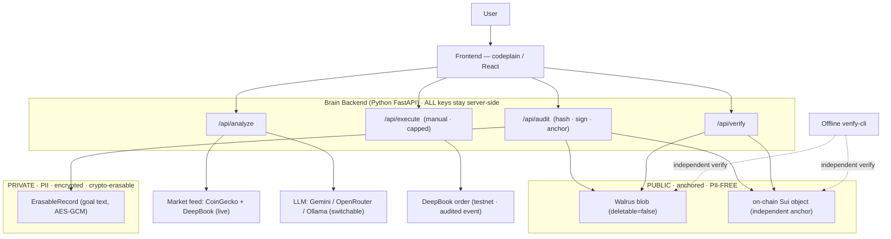
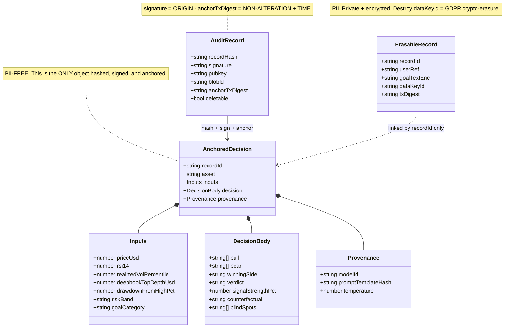
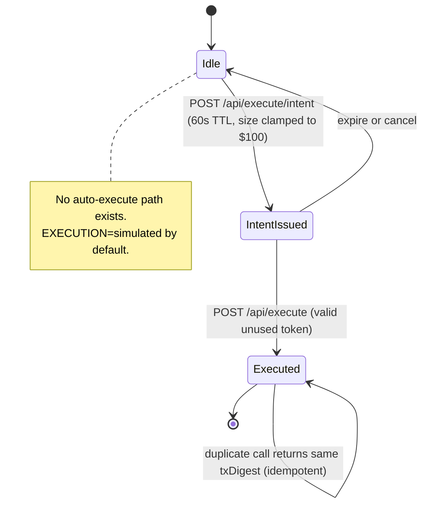

# GlassBox — Design

Diagrams for the v3 architecture (see `SPEC.md` for the contract). Mermaid renders in GitHub, Notion, and slides. Claim discipline applies here too: **tamper-evident**, never "tamper-proof"; signature proves **origin**, the Sui anchor proves **non-alteration + an independent timestamp**.

> **Status (see `SPEC.md` → Build status):** shipped today over a **Python FastAPI** brain (provider-agnostic LLM, currently `gemini-2.5-flash`) = `analyze` (relevance gate + **live CoinGecko + DeepBook** feeds), `audit` (ed25519 sign + Walrus, which **registers a real on-chain Sui object** = the anchor), `verify`, the offline `verify-cli`, and an **interactive tamper** demo. Only a *dedicated* anchor transaction and **DeepBook execute** remain Tier-2 (`EXECUTION=simulated`). The served `static/index.html` is the working frontend + demo fallback; codeplain-rendered React is the spec-first path. 100 tests + CI.

---

## 1. Sequence — the golden path (decide → prove → verify)

*The spine of the product and the pitch. Serves Sui (real-world flow), BGA (auditable reasoning), and answers "how does the proof work?".*

```mermaid
sequenceDiagram
    actor U as User
    participant FE as Frontend (codeplain/React)
    participant BE as Brain Backend (Python FastAPI)
    participant MK as Market Feed
    participant LLM as LLM (provider-agnostic; Gemini default)
    participant WAL as Walrus
    participant SUI as Sui

    rect rgb(238,245,255)
    Note over U,SUI: 1 — DECIDE
    U->>FE: goal + SUI/USDC + risk
    FE->>BE: POST /api/analyze
    BE->>MK: fetch 5 features (closed candles)
    MK-->>BE: price, RSI, vol%, depth, drawdown
    Note over BE: freeze inputs · classify goal to enums
    par Round 1 — openings (parallel)
        BE->>LLM: Bull opening (cite ONLY inputs)
    and
        BE->>LLM: Bear opening (cite ONLY inputs)
    end
    par Round 2 — rebuttals (parallel)
        BE->>LLM: Bull rebuts Bear + revised conviction
    and
        BE->>LLM: Bear rebuts Bull + revised conviction
    end
    BE->>LLM: Arbiter resolves (smart model)
    LLM-->>BE: verdict · counterfactual (numbers computed in code)
    Note over BE: validate JSON (1 repair retry) · scrub PII echo · compute Signal Strength
    BE-->>FE: Decision (grounded in frozen inputs)
    FE-->>U: debate · verdict · signal band · blind spots · disclaimer
    end

    rect rgb(235,250,240)
    Note over U,SUI: 2 — PROVE
    U->>FE: "Prove it"
    FE->>BE: POST /api/audit
    Note over BE: build PII-free AnchoredDecision · canonical hash · ed25519 sign
    BE->>WAL: PUT blob (deletable=false)
    WAL-->>BE: blobId
    BE->>SUI: Walrus registers the blob as an on-chain Sui object
    SUI-->>BE: suiObjectId + epoch (the anchor)
    BE-->>FE: AuditRecord {hash, signature, blobId, anchor}
    end

    rect rgb(255,240,240)
    Note over U,SUI: 3 — VERIFY (the wow)
    U->>FE: "Verify" / edit the record (tamper)
    FE->>BE: GET /api/verify/:id
    BE->>WAL: fetch blob → recompute hash
    BE->>SUI: read the Sui object + epoch (independent)
    BE-->>FE: {hashMatch, signatureValid, anchorTimestamp}
    FE-->>U: MATCH ✅  (or MISMATCH ❌ if altered)
    end
```

---

## 2. Architecture — containers + the trust boundary

*The "system at a glance" slide. The dashed boxes make the security/GDPR design legible in 3 seconds: what is public + PII-free vs private + erasable.*



---

## 3. Data model — the two-object GDPR split

*A real differentiator for the compliance (Solvimon/Dana) and Sui judges: privacy is designed in. Only a PII-free object is ever anchored; the personal data lives in an erasable store linked by id only.*



---

## 4. Execute safety — the intent-token state machine

*Shows there is no auto-trade path: execution needs two distinct user actions, a size cap, and is idempotent. Defuses the "you let an AI trade my money" objection.*


