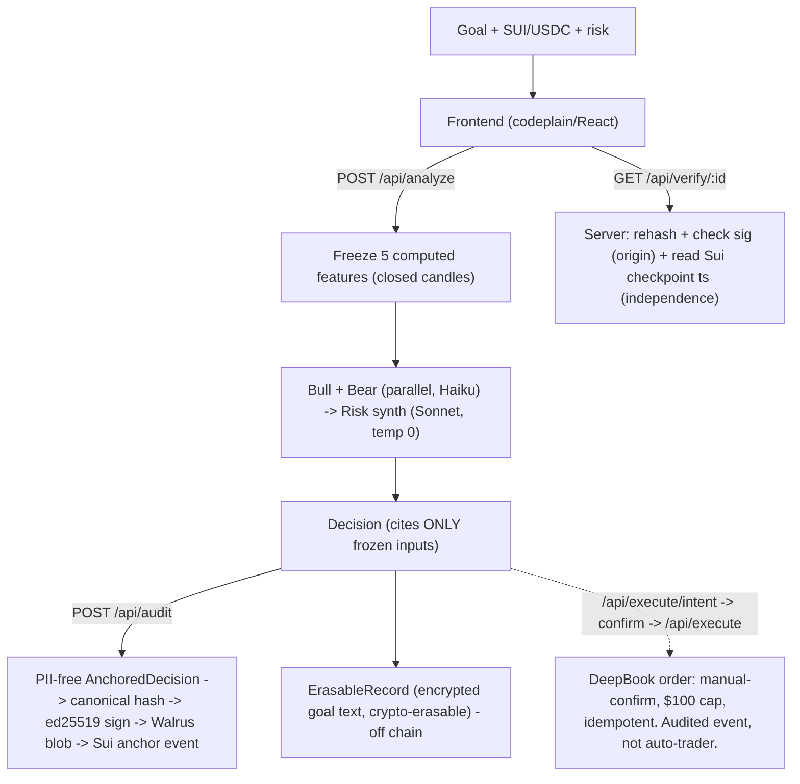

# GlassBox — Build Spec (v3, post regulatory reconciliation)

> Tamper-EVIDENT accountability for AI financial decisions: a signed, independently-anchored record of what an AI decided, on what inputs, and when — verifiable by anyone against a network we don't control, so it can't be altered after the fact.

Team: The Start of a Joke (Supavich + Orestis) · Encode Vibe Coding Hackathon · Submit Sun 21 Jun 12:00 BST.
v3 folds in a 10-expert red-team (9 lenses + a financial-regulatory counsel) and 5 reconciled cross-lens conflicts. Locked decisions: primaries = **Sui + BGA + main finale**; FLock + Solvimon = narrative only; codeplain = frontend; lead = **retail-legible demo, B2B-compliance business line**.

## Claim discipline (read first — never violate)
- Say **"tamper-evident"** and **"can't be altered after signing,"** NEVER "tamper-proof" / "provable to anyone" / "impossible to fake" (in app, slides, README, Devpost, or speech).
- **Signature proves ORIGIN** ("GlassBox produced this"). **Sui anchor proves NON-ALTERATION + an independent TIMESTAMP** (a network/clock the auditee can't control). Independence comes from the chain, not the key.
- It is an **evidence layer**, NOT model validation and NOT a "compliance guarantee." Pitch "designed to map to" record-keeping rules, never "makes your AI compliant."
- Honest caveat to state, not gloss: the anchor proves the record wasn't altered after signing and existed by time T — it does **not** prove the inputs were truthful or the decision correct.

## The product
A retail-legible app: user enters a plain-English goal for SUI/USDC + risk. The server computes 5 real market features (closed candles, no lookahead), freezes them, and a Bull + Bear agent argue using ONLY those numbers; a Risk agent resolves into a Decision (verdict, vol-targeted size, a mechanical Signal Strength, a counterfactual, named blind-spots). The server hashes a PII-free record, signs it (ed25519), anchors the hash on Sui (independent timestamp) + stores the blob on Walrus, and exposes an offline verifier. The same record is what a fund hands its auditor (B2B line).

## Wow moment (network-free, local)
Watch the AI argue → it decides → "Alter the record" → re-verify → loud red MISMATCH + diff. *"I change one word; it's caught. No one can rewrite an AI's decision after the fact — not even the fund being audited. We're not selling that the AI was right; we're selling that no one can quietly edit what it decided."*

## Architecture
codeplain builds the React frontend; a hand-wired Node/TS backend hosts agents + integrations behind env switches. Keys stay server-side.



## Failure-proof switches (`.env`)
```
LLM_PROVIDER = anthropic | gemini    # anthropic default (Gemini billing-blocked + must be rotated)
AUDIT_SINK   = walrus | local        # local = pre-written blob for the demo
ANCHOR       = sui | tsa | none       # sui = on-chain timestamp (primary); tsa = RFC 3161 fallback
EXECUTION    = simulated | deepbook    # simulated default; NO auto-exec path exists at all
```

## Data model (two objects — GDPR-safe)
```ts
// A) ANCHORED + SIGNED + HASHED. Contains ZERO free text / identifiers.
interface AnchoredDecision {
  schemaVersion: "1.0.0";
  recordId: string;            // random uuid, NOT derived from user/session
  createdAt: string;
  asset: "SUI/USDC";
  inputs: {                    // frozen at analyze-time; computed on CLOSED candles
    priceUsd: number; trendPctVs20MA: number; rsi14: number;
    realizedVolPercentile: number; deepbookTopDepthUsd: number;
    spreadBps: number; drawdownFromHighPct: number; asOfIso: string;
    riskBand: "low"|"moderate"|"high";          // enum, NOT the user's sentence
    horizonDays: number; goalCategory: string;  // enum, classified server-side
  };
  inputsSource: { feed: string; fetchedAtIso: string };
  decision: {
    bull: string[]; bear: string[];             // must NOT restate user input (scrubbed)
    winningSide: "bull"|"bear"; whyResolved: string;
    riskNote: string; suggestedSizePct: number; // vol-targeted (falls as vol rises)
    verdict: "BUY"|"HOLD"|"AVOID";
    signalStrengthPct: number;                  // mechanical, see formula; NOT "confidence"
    signalBand: "Low"|"Medium"|"High";
    counterfactual: string; blindSpots: string[];
  };
  provenance: { llmProvider: string; modelId: string; promptTemplateHash: string; temperature: 0; executionMode: "simulated"|"deepbook" };
}

interface AuditRecord {
  recordHash: string;          // sha256(canonicalize(AnchoredDecision)) — RFC 8785 JCS
  signature: string; pubkey: string;            // ed25519 origin; pubkey published in README
  sink: "walrus"|"local"; blobId: string|null; deletable: false; storedUntilEpoch: number|null;
  anchorTxDigest: string|null; tsaToken: string|null;   // independence
}

// B) NOT anchored. Encrypted, crypto-erasable (GDPR Art.17). Holds the PII.
interface ErasableRecord {
  recordId: string;            // the only join key back to A
  userRef: string; goalTextEnc: string; riskProfileTextEnc: string;
  rawPromptEnc?: string; dataKeyId: string; txDigest?: string; createdAt: string;
}
```

## Signal Strength (relabeled from "confidence" — quant-proven honest)
```
a = |bull_score - bear_score| / 5      # each agent emits 0-5 conviction; a in [0,1]
v = realized-vol percentile (90d)      # in [0,1]
m = manipulation/thin-liquidity flag   # 1 if >Nσ move on below-median vol OR depth < threshold
signalStrengthPct = round(100 * a * (1 - v) * (1 - m))
```
Monotone non-increasing in risk by construction (`d/dv = -a <= 0`); high vol -> 0; any manipulation flag -> 0. Position size: `size% = clamp(risk_budget / realizedVol, 0, cap)`, cap = {low:5, moderate:15, high:30}. Both signal and size fall together as risk rises.

## Backend endpoints
| Path | Notes |
|---|---|
| `POST /api/analyze` | Freeze 5 features -> Bull+Bear (parallel Haiku) -> Risk synth (Sonnet, temp 0). Zod-validate, 1 repair retry, safe-HOLD fallback. Goal text delimited + injection-guarded + classified to enums server-side. Cite-only-inputs enforced. |
| `POST /api/audit` | Build PII-free AnchoredDecision (scrub free text) -> canonical hash -> ed25519 sign -> Walrus `deletable=false`+epochs -> emit Sui anchor event {recordHash,pubkey,blobId}. Store ErasableRecord (encrypted) separately. |
| `GET /api/verify/:id` | Server: refetch blob, recompute hash, check signature (origin), resolve anchorTxDigest on Sui + read checkpoint timestamp (independence). Returns {hashMatch, signatureValid, anchorTimestamp, anchorValid}. |
| `POST /api/execute/intent` | Returns {intentToken, clampedSizeUsd, asset, expiresAt:+60s}. UI shows confirm modal. |
| `POST /api/execute` | Requires valid unused intentToken. Hard cap MAX_EXEC_USD=100 (reject if over). Single-use-token idempotency. Anchor must exist first. Testnet only. |
| `GET /api/health` | Active provider per switch. |
| `verify-cli` | Standalone offline verifier: blobId + pubkey -> reproduces hashMatch + signatureValid + reads Sui anchor timestamp, WITHOUT GlassBox running. This is the independence proof. |

## Regulatory copy (paste verbatim)
**UI disclaimer (under every Decision + gate before demo):**
> "GlassBox is an educational and analytical tool. It does **not** provide personalised or financial advice or a recommendation to buy, sell, or hold any asset. SUI/USDC and all cryptoassets are high-risk and largely unregulated; you could lose all the money you put in. Outputs are AI-generated from a limited set of market inputs and may be wrong. 'Signal strength' is a mechanical score, **not** a probability of profit. You are solely responsible for any order you place. Nothing here is an offer or inducement."

**FCA risk-warning banner (UK retail surface):**
> "Don't invest unless you're prepared to lose all the money you invest. This is a high-risk investment and you are unlikely to be protected if something goes wrong."

**One-line claim (compliant + credible):**
> "GlassBox produces a signed, independently-anchored, tamper-evident record of what an AI decided and why — so a fund can prove its automated decisions to an auditor or regulator."

**Regulation-mapping line (deck):**
> "Designed to map to SEC Rule 17a-4 audit-trail record-keeping and MiFID II RTS 6 algorithmic-trading logging, and to provide the documentation/monitoring evidence that SR 11-7 and EU AI Act Art 12 expect. Evidence layer, not a model-validation substitute."

## Business (Solvimon — narrative only, no billing code)
B2B positioning: *"Firms running AI in investment workflows must already keep auditable, tamper-evident records of what was decided, on what inputs, by which model version, and when (RTS 6 / 17a-4). Today they hand-roll brittle logs no auditor trusts. GlassBox is the decision-evidence layer designed to map to those record-keeping rules — it produces the evidence, it does not validate your model."*
Pricing: **per-analyst seat + evidence-retention tier (records retained/exportable) + audit-export-pack add-on**. Per-analysis = internal fair-use cap only. SKU = "Evidence Retention," never "Compliance." (Demo counter shows "Evidence records: N retained / export pack," NOT "1 credit per analysis.")

## Execution framing (resolves the Solvimon vs Sui/BGA tension)
Keep the real DeepBook order in the demo (Sui real-world + BGA), but frame it as **"you place your own order — and that action is *also* recorded"**: manual-confirm, $100 cap, testnet, off by default, positioned as another *audited event*, not an auto-trader. Reinforces the evidence story instead of competing with it.

## Build order / tiers
1. **Rotate the Gemini key. `git init`, commit `.gitignore` first, confirm `.env` never in `git status`.** Burner Sui wallet only.
2. **Install Node + verify codeplain renders a buildable React app (<=2h) or fall back to Vite+React.**
3. `/api/health` + `cors()` + frontend base-URL handshake.
4. `/api/analyze` (freeze inputs, Bull/Bear parallel Haiku + Risk Sonnet, Zod-validate, scrub, classify-to-enum). Target <12s.
5. `/api/audit` (PII-free object, sign, Walrus `deletable=false`, **Sui anchor event**) + `/api/verify` + offline `verify-cli`.
6. `/api/execute` LAST: pre-built BalanceManager, simulated default, two-phase intent token, $100 cap.

- **Tier 1 (must work):** analyze (grounded+validated) + audit (signed + Walrus + Sui anchor) + verify + offline verifier + cached demo + local MATCH/MISMATCH. Wins BGA + Sui + finale.
- **Tier 2:** real pre-staged DeepBook order shown as an audited event.
- **Gate Sat 21:00:** if T1 not green, cut Tier 2.

## Acceptance criteria (v3)
1. Every number cited in `bull`/`bear`/`riskNote` exists in frozen `inputs` (validated; else repair). No invented figures, no re-fetch at audit time.
2. `signalStrengthPct` and `suggestedSizePct` both DECREASE as `realizedVolPercentile` rises (two-input test); manipulation flag forces signal to 0.
3. Anchored blob contains **zero free-text user input and zero identifiers** (test asserts anchored JSON excludes goalText/riskProfileText/userId).
4. `recordHash = sha256(canonicalize(AnchoredDecision))`; `/api/verify` returns `signatureValid:true` + `hashMatch:true` only for a server-signed record; a third-party blob fails the signature check.
5. `/api/verify` returns an `anchorTimestamp` sourced from **Sui consensus**, not from the Decision JSON.
6. `verify-cli` reproduces hashMatch + signatureValid + anchor timestamp offline with only blobId + pubkey.
7. Erasure: destroying the per-record data key makes `goalText` unrecoverable while the anchored decision + recordHash still verify (MATCH).
8. `EXECUTION=simulated` (default) never calls DeepBook; `/api/execute` returns 409 without a valid unused intentToken, 400 if size > $100, same txDigest on duplicate calls.
9. The word "tamper-proof" appears nowhere in app/slides/README/Devpost; "tamper-evident" used instead.
10. No secret (Gemini key, Sui private key) ever appears in `git status` or the public repo.
11. Golden path runs end-to-end on localhost with safe switch values; a recorded fallback video exists.

## Out of scope
Mainnet/real money. Auto-execution (no such path exists). Real billing (credits = display + business slide). FLock integration. Full TradingAgents framework. Assets other than SUI/USDC. Live news (named blind spot). Model validation / any "makes you compliant" claim. Customer co-signing (roadmap line only).

## Honest caveats (state in pitch + README, don't gloss)
The Sui anchor proves non-alteration + an independent timestamp on an honest testnet clock; it does NOT attest input *truthfulness* (an honest clock over lied inputs still anchors the lie) — bounded by `inputsSource` provenance. The signature proves origin, not independence. Signal strength is analytical agreement discounted for vol/liquidity, not a probability of profit.

## Red-team changelog (v3)
Resolved across 10 experts: hallucinated inputs -> computed + cite-only + frozen; forgeable/over-claimed proof -> ed25519 sign (origin) + **Sui on-chain anchor (independence+timestamp)** + offline verifier + "tamper-evident"; GDPR -> PII-free anchored object + encrypted crypto-erasable store; vibe-confidence -> monotone Signal Strength; regulated-activity risk -> no auto-exec path, manual intent-token + $100 cap; business -> evidence-retention pricing mapped to 17a-4/RTS 6, not "1 credit"; demo -> cached/localhost/recorded; live key -> rotate + git discipline.
